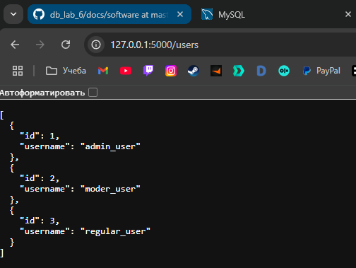
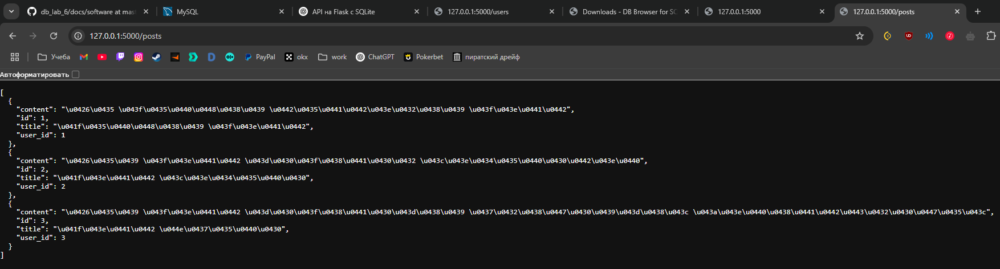

# README

## Опис проєкту

Цей проєкт — REST API на Flask з базою даних SQLite.  
Він реалізує керування користувачами, ролями, дозволами та публікаціями (постами).

---

## Початок роботи

### Встановлення залежностей

```bash
pip install -r requirements.txt
```

### Ініціалізація бази даних

База створюється автоматично при першому запуску додатку.

---

## Запуск

1. Запусти сервер:

```bash
python app.py
```

2. Сервер буде доступний за адресою:  
`http://127.0.0.1:5000`

---

## Основні ендпоінти API

- `/register` — реєстрація користувача
- `/login` — логін користувача
- `/posts` — створення і отримання постів
- `/roles`, `/permissions`, `/users` — додаткові кінцеві точки (за потребою)

---

## Заповнення бази початковими даними

Для додавання тестових ролей, дозволів, користувачів і постів використовуйте SQL-скрипт із файлу `seed.sql` або вручну через SQLite.

---

## Тестування API

Для тестування API можна використовувати `curl`, Postman або будь-який інший HTTP клієнт.

---

## Скріни тестів

Нижче — приклади результатів тестування API:

### 1. Отримання списку користувачів


---

### 2. Отримання списку постів

